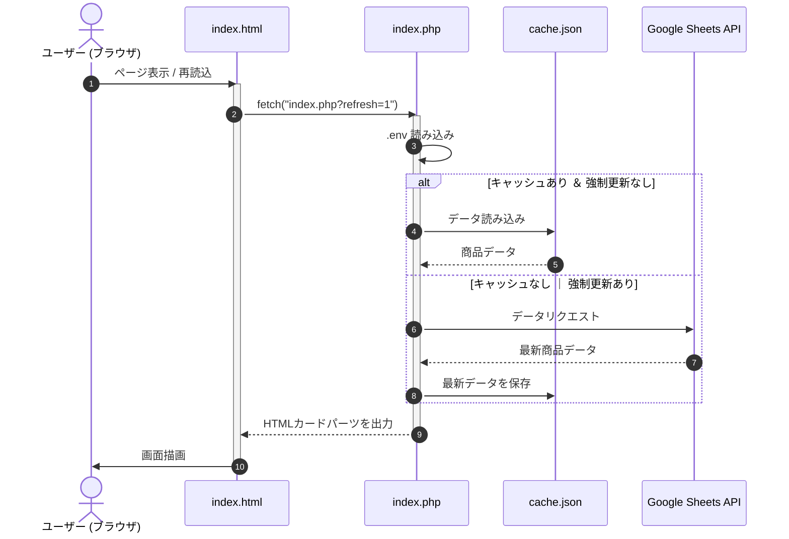

# What
楽天GOLDなど PHP が使えないサーバーで、関節フリーキックしてレンダリングするシステムのサンプルです。  
Googleスプレッドシートを DB として利用することで、非エンジニアの方も運用しやすいと考えています。  
  
「React や Vue というか JS だけでいいじゃないか」と思われるかもしれませんが、一例として。  
「このような運用やってました」ということを示すのが目的のため、どうかご容赦ください。

# Who
- 静的ページをハードコードして運用している人
- ポータルサイトの更新をいい感じに運用したい人

# How
1. スプレッドシートに情報を埋める（[サンプル](https://docs.google.com/spreadsheets/d/1S6k6H1G4H0TnbncN_wCT-cz4r4fe0-cYb0ryqzKc3Fs/edit?gid=0#gid=0)）
2. 運用サーバーとは別のレンタルサーバーなどに PHP と `.env` を配置する
3. 運用サーバーに `index.html` を配置する
4. スプレッドシートの情報を更新したらフロントページの [再読込] をクリックして更新する

> [!WARNING]
> 本番運用はスプレッドシートを組織内のみに公開にし、サービスアカウントで情報を取得する運用が良いかと思います。

## ファイルツリー
```text
.
├── dist/
│ ├── index.html           # メイン画面
│ ├── index.php            # プロキシ・バックエンド処理
│ ├── style.css            # 追加スタイル
│ └── main.js              # index.php にリクエストを送る
├── .env.sample            # 環境変数サンプル
└── docker-compose.yml     # ローカル検証用 PHP コンテナ
```

## シーケンス図

